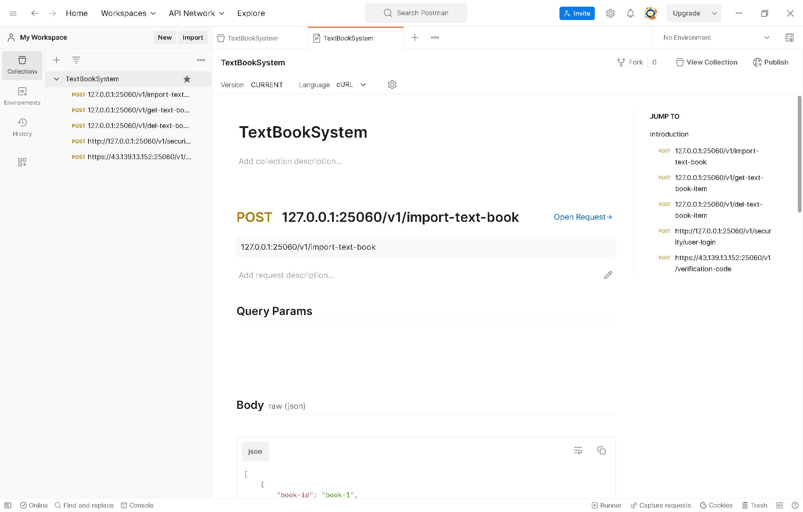
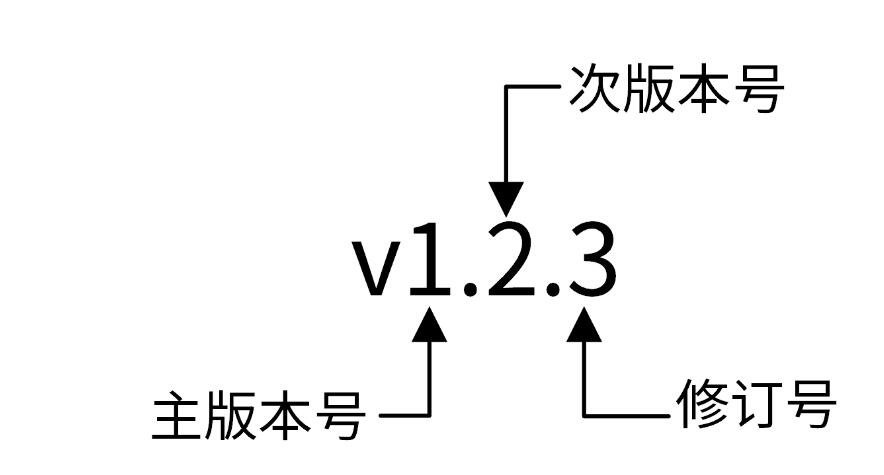
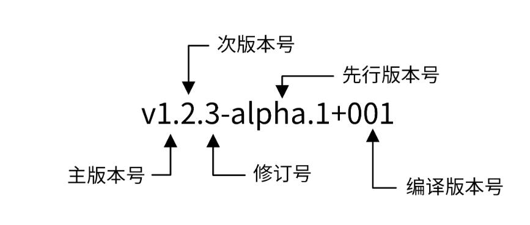

# standardized-items
边学习，边标准化


# 项目开发应该如何规范化
## 确保大家开发的是“一个应用”

```
    1. 统一代码风格
    2. 目录，文件。见名知意
    3. 接口风格，格式统一
    4. 规范错误码
```

# 有哪些地方需要制定规范

```
    非编码类规范：
        开源规范、文档规范、版本规范、commit规范、发布规范
    
    编码类规范：
        目录规范、代码规范、接口规范、日志规范、错误码规范
```


# 开源规范

```
    我们为什么一定要知道开源规范呢。

        原因主要有两方面
            
            一是，开源项目在代码质量、代码规范、文档等方面都要比非开源项目要求更高。在项目开发中按照开源项目的要求规范自己的项目，可以以更好的提高项目质量

            二是，为了不重复造轮子
        
    一个开源项目一定需要一个开源协议，开源协议规定了你在使用开源软件时的权利和责任，也就是规定了你可以做什么，不可以做什么。所以，开源规范的第一条规范就是选择一个合适的开源协议。

    常用的 6 种开源协议，也就是 GPL、MPL、LGPL、Apache、BSD 和 MIT

```


## 开源规范具有哪些特点

```
    除了要遵守上面所说的编码类规范和非编码类规范之外,还需要遵守下面几个规范。

    第一，开源项目应该有一个更高的单元覆盖率

    第二，要确保整个代码库和提交记录中，不能出现内部 IP、内部域名、密码、密钥这类信息。

    第三，当我们的开源项目被别的开发者提交 pull request、issue、评论时，要及时处理，一方面可以确保项目不断被更新，另一方面也可以激发其他开发者贡献代码的积极性。

    第四，好的开源项目，应该能够持续地更新功能，修复 Bug。
```


#  文档规范

```
    很多开发者都非常注重代码产出，但不注重文档产出。开发者们觉得即使没有软件文档也没有太大关系，不影响软件交付。这种看法是错误的，因为文档属于软件交付的一个重要组成部分，没有文档的项目很难理解、部署、使用

    项目中最需要的文档有如下3类文档，
        
        分别是README文档
        
        项目文档
        
        API接口文档
```

## README 规范

```
README文档是项目的门面、他是开发者学习项目时第一个阅读的文档，会放在项目的根目录下

主要用来介绍项目的功能、安装、部署以及如何使用。
```

## 项目文档规范

```shell
项目文档包括一切需要文档化的内容，他们通常放在/docs目录下。我们在创建团队的项目文档时，通常会预先规划并创建好一些目录，用来存放不同的文档。因此在开始项目开发之前，我们也要指定一个软件文档规范。好的文档，易读和可以快速定位文档

不同的项目有不同的文档需求，在指定文档规范时，可以考虑包含两类文档

    开发文档：用来说明项目的开发流程，比如如何搭建开发环境，构建二进制文件，测试，部署等

    用户文档：软件的使用文档，对象一般是软件的使用者，内容可根据需要添加。比如可以包括API文档、SDK文档、安装文档、功能介绍文档、最佳实践、操作指南、常见问题等。

    例子：

    
docs
├── devel                            # 开发文档，可以提前规划好，英文版文档和中文版文档
│   ├── en-US/                       # 英文版文档，可以根据需要组织文件结构
│   └── zh-CN                        # 中文版文档，可以根据需要组织文件结构
│       └── development.md           # 开发手册，可以说明如何编译、构建、运行项目
├── guide                            # 用户文档
│   ├── en-US/                       # 英文版文档，可以根据需要组织文件结构
│   └── zh-CN                        # 中文版文档，可以根据需要组织文件结构
│       ├── api/                     # API文档
│       ├── best-practice            # 最佳实践，存放一些比较重要的实践文章
│       │   └── authorization.md
│       ├── faq                      # 常见问题
│       │   ├── iam-apiserver
│       │   └── installation
│       ├── installation             # 安装文档
│       │   └── installation.md
│       ├── introduction/            # 产品介绍文档
│       ├── operation-guide          # 操作指南，里面可以根据RESTful资源再划分为更细的子目录，用来存放系统核心/全部功能的操作手册
│       │   ├── policy.md
│       │   ├── secret.md
│       │   └── user.md
│       ├── quickstart               # 快速入门
│       │   └── quickstart.md
│       ├── README.md                # 用户文档入口文件
│       └── sdk                      # SDK文档
│           └── golang.md
└── images                           # 图片存放目录
    └── 部署架构v1.png

```

## API 接口文档规范

```
接口文档，又称为API文档。一般由开发人员编写，用来描述组件提供的API接口以及如何调用这些API接口。

在项目初期，接口文档可以解耦前后端。让前后端并行开发，前端只需要按照接口文档实现调用逻辑，后端只需要按照接口文档提供功能

前后端都完成开发之后，就可以直接进行联调，提高开发效率。在项目后期接口文档可以提供给使用者，不仅可以降低组件的使用门槛，还能减少沟通成本

显然，一个有固定格式结构清晰，内容完善的接口文档，就非常重要了

一下是一些推荐的方式
```


```
但是这里，我更倾向于使用postman生成文档
```



### API 文档遵循规范
```
    一个规范的API接口文档
        通常要包含一个完整的接口介绍文档
        
        API接口变更历史文档
        
        通用说明
        
        数据接口说明
        
        错误码描述
        
        API接口使用文档
            API接口使用文档需要包含接口描述、请求方法、请求参数、输出参数、请求示例


    接口文档拆分为以下几个 Markdown 文件

        README.md ：API 接口介绍文档，会分类介绍 IAM 支持的 API 接口，并会存放相关 API 接口文档的链接，方便开发者查看。
        
        CHANGELOG.md ：API 接口文档变更历史，方便进行历史回溯，也可以使调用者决定是否进行功能更新和版本更新。
        
        generic.md ：用来说明通用的请求参数、返回参数、认证方法和请求方法等。
        
        struct.md ：用来列出接口文档中使用的数据结构。这些数据结构可能被多个 API 接口使用，会在 user.md、secret.md、policy.md 文件中被引用。
        
        user.md 、 secret.md 、 policy.md ：API 接口文档，相同 REST 资源的接口会存放在一个文件中，以 REST 资源名命名文档名。
        
        error_code.md ：错误码描述，通过程序自动生成。

    更详细的 API 接口文档规范，可以参考这个https://github.com/marmotedu/iam/tree/master/docs/guide/zh-CN/api
```

## 版本规范
```

    在做项目开发时，需要把所有的组件都加入版本机制。原因主要有两个

        通过版本号，我们可以很明确的的知道组件是哪个版本。从而定位到该组件的功能和代码，方便定位问题

        二是发布组件时携带版本号，可以让使用者知道目前的进度。以及使用版本和上一个版本的功能差别等

        目前主流的版本规范时语义化版本规范

```

### 什么是语义化版本规范(SemVer)
```

    语义化版本规范（SemVer，Semantic Versioning）是Github起草的一个具有指导意义、统一版本号的规范。
    它规定了版本号的表示，增加和比较方式，以及不同版本号代表的含义


        在该规范下，版本号以及其更新方式包含了相邻版本见的底层代码和修改内容的信息语义化版本格式为：
            
            主版本号.次版本号.修订号(X.Y.Z)、其中X、Y、Z为非负的整数。禁止在数字前方补零

            版本号可以按一下规则递增：

                主版本号(MAJOR):当做了不兼容的API修改
                
                次版本号(MINOR):当作了向下兼容的功能性新增及修改，这里有一个不成文的规定需要注意，偶数为稳定版本，奇数为开发版本。

                修订号(PATCH):当做了向下兼容的问题修正

    好下面我们来看例子：

```



```
        例如，v1.2.3 是一个语义化版本号。1：主版本号，2：次版本号，3：修订号

        还有一种版本：v1.2.3-alpha，这其实就是把先行版本号（Pre-release）和版本编译元数据，作为延伸到了  主版本号.次版本号.修订号  的后面。格式为：

            格式为 X.Y.Z[-先行版本号][+版本编译元数据]

```


```

    我们来分别看下先行版本号和版本编译元数据是什么意思。

        先行版本号意味着，该版本不稳定，可能存在兼容性问题，格式为：X.Y.Z-[一连串以句点分隔的标识符] ，比如下面这几个例子：

            1.0.0-alpha
            1.0.0-alpha.1
            1.0.0-0.3.7
            1.0.0-x.7.z.92

        编译版本号，一般是编译器在编译过程中自动生成的，我们只定义其格式，并不进行人为控制。下面是一些编译版本号的示例：

            1.0.0-alpha+001
            1.0.0+20130313144700
            1.0.0-beta+exp.sha.5114f85

        注意，先行版本号和编译版本号只能是字母、数字，且不可以有空格。

```

```

    语义化版本控制规范语义化版本控制规范比较多，这里我给你介绍几个比较重要的。如果你需要了解更详细的规范，可以参考 这个链接 https://semver.org/lang/zh-CN/ 的内容。
    
    标记版本号的软件发行后，禁止改变该版本软件的内容，任何修改都必须以新版本发行。
    
    主版本号为零（0.y.z）的软件处于开发初始阶段，一切都可能随时被改变，这样的公共 API 不应该被视为稳定版。1.0.0 的版本号被界定为第一个稳定版本，之后的所有版本号更新都基于该版本进行修改。
    
    修订号 Z（x.y.Z | x > 0）必须在只做了向下兼容的修正时才递增，这里的修正其实就是 Bug 修复。
    
    次版本号 Y（x.Y.z | x > 0）必须在有向下兼容的新功能出现时递增，在任何公共 API 的功能被标记为弃用时也必须递增，当有改进时也可以递增。其中可以包括修订级别的改变。每当次版本号递增时，修订号必须归零。
    
    主版本号 X（X.y.z | X > 0）必须在有任何不兼容的修改被加入公共 API 时递增。其中可以包括次版本号及修订级别的改变。每当主版本号递增时，次版本号和修订号必须归零。

```

```

    如何确定版本号？
    说了这么多，我们到底该如何确定版本号呢？
    
    这里我给你总结了这么几个经验：第一，在实际开发的时候，我建议你使用 0.1.0 作为第一个开发版本号，并在后续的每次发行时递增次版本号。
    
    第二，当我们的版本是一个稳定的版本，并且第一次对外发布时，版本号可以定为 1.0.0。
    
    第三，当我们严格按照 Angular commit message 规范提交代码时，版本号可以这么来确定：
    
        fix 类型的 commit 可以将修订号 +1。
        
        feat 类型的 commit 可以将次版本号 +1。
        
        带有 BREAKING CHANGE 的 commit 可以将主版本号 +1。


    总结
    一套好的规范，就是一个项目开发的“规矩”，它可以确保整个项目的可维护性、可阅读性，减少 Bug 数等
    
    新开发的项目最好按照开源标准来规范，以驱动其成为一个高质量的项目。
    
    开发之前，最好提前规范好文档目录，并选择一种合适的方式来编写 API 文档。在这门课的实战项目中，我采用的是 Markdown 格式，也推荐你使用这种方式。
    
    项目要遵循版本规范，目前业界主流的版本规范是语义化版本规范，也是我推荐的版本规范。

    参考信息
        https://github.com/marmotedu/geekbang-go/blob/master/%E5%BC%80%E6%BA%90%E8%A7%84%E8%8C%83%E8%AF%A6%E7%BB%86%E5%88%97%E8%A1%A8.md

        https://raw.githubusercontent.com/marmotedu/iam/master/README.md

        https://github.com/marmotedu/iam/tree/master/docs/guide/zh-CN/api
```


# commit信息规范
## 暂时不搞

# 如何组织一个可维护、可扩展的代码目录
## 如何规范目录？
```
一个好的目录结构至少要满足以下几个要求。

    命名清晰：目录命名要清晰、简洁，不要太长，也不要太短，目录名要能清晰地表达出该目录实现的功能，并且目录名最好用单数。一方面是因为单数足以说明这个目录的功能，另一方面可以统一规范，避免单复混用的情况。
    
    功能明确：一个目录所要实现的功能应该是明确的、并且在整个项目目录中具有很高的辨识度。也就是说，当需要新增一个功能时，我们能够非常清楚地知道把这个功能放在哪个目录下。
    
    全面性：目录结构应该尽可能全面地包含研发过程中需要的功能，例如文档、脚本、源码管理、API 实现、工具、第三方包、测试、编译产物等。
    
    可观测性：项目规模一定是从小到大的，所以一个好的目录结构应该能够在项目变大时，仍然保持之前的目录结构。
    
    可扩展性：每个目录下存放了同类的功能，在项目变大时，这些目录应该可以存放更多同类功能。

```
### 现在来看 2 个具体的、可以作为目录规范的目录结构。
```

通常，根据功能，我们可以将目录结构分为结构化目录结构和平铺式目录结构两种。结构化目录结构主要用在 Go 应用中，相对来说比较复杂；而平铺式目录结构主要用在 Go 包中，相对来说比较简单。

    平铺式目录结构：

        平铺式目录结构一个 Go 项目可以是一个应用，也可以是一个代码框架 / 库，当项目是代码框架 / 库时，比较适合采用平铺式目录结构。
        
        平铺方式就是在项目的根目录下存放项目的代码，整个目录结构看起来更像是一层的，这种方式在很多框架 / 库中存在，使用这种方式的好处是引用路径长度明显减少，比如
         
         github.com/marmotedu/log/pkg/options，可缩短为 github.com/marmotedu/log/options。
         
         例如 log 包 github.com/golang/glog 就是平铺式的，
         
         目录如下：$ ls glog/
         
            glog_file.go glog.go glog_test.go LICENSE README

   
    结构化目录结构

        当前 Go 社区比较推荐的结构化目录结构是 project-layout（https://github.com/golang-standards/project-layout） 。虽然它并不是官方和社区的规范，但因为组织方式比较合理，被很多 Go 开发人员接受。所以，我们可以把它当作是一个事实上的规范。

        首先，我们来看下在开发一个 Go 项目时，通常应该包含的功能。这些功能内容比较多，我放在了 GitHub 的 Go 项目通常包含的功能（https://github.com/marmotedu/geekbang-go/blob/master/Go%E9%A1%B9%E7%9B%AE%E9%80%9A%E5%B8%B8%E5%8C%85%E5%90%AB%E7%9A%84%E5%8A%9F%E8%83%BD.md） 里，我们设计的目录结构应该能够包含这些功能。

        我结合 project-layout，以及上面列出的 Go 项目常见功能，总结出了一套 Go 的代码结构组织方式，也就是 IAM 项目使用的目录结构。这种方式保留了 project-layout 优势的同时，还加入了一些我个人的理解，希望为你提供一个拿来即用的目录结构规范。
        
```


``` shell

├── api
│   ├── openapi
│   └── swagger
├── build
│   ├── ci
│   ├── docker
│   │   ├── iam-apiserver
│   │   ├── iam-authz-server
│   │   └── iam-pump
│   ├── package
├── CHANGELOG
├── cmd
│   ├── iam-apiserver
│   │   └── apiserver.go
│   ├── iam-authz-server
│   │   └── authzserver.go
│   ├── iamctl
│   │   └── iamctl.go
│   └── iam-pump
│       └── pump.go
├── configs
├── CONTRIBUTING.md
├── deployments
├── docs
│   ├── devel
│   │   ├── en-US
│   │   └── zh-CN
│   ├── guide
│   │   ├── en-US
│   │   └── zh-CN
│   ├── images
│   └── README.md
├── examples
├── githooks
├── go.mod
├── go.sum
├── init
├── internal
│   ├── apiserver
│   │   ├── api
│   │   │   └── v1
│   │   │       └── user
│   │   ├── apiserver.go
│   │   ├── options
│   │   ├── service
│   │   ├── store
│   │   │   ├── mysql
│   │   │   ├── fake
│   │   └── testing
│   ├── authzserver
│   │   ├── api
│   │   │   └── v1
│   │   │       └── authorize
│   │   ├── options
│   │   ├── store
│   │   └── testing
│   ├── iamctl
│   │   ├── cmd
│   │   │   ├── completion
│   │   │   ├── user
│   │   └── util
│   ├── pkg
│   │   ├── code
│   │   ├── options
│   │   ├── server
│   │   ├── util
│   │   └── validation
├── LICENSE
├── Makefile
├── _output
│   ├── platforms
│   │   └── linux
│   │       └── amd64
├── pkg
│   ├── util
│   │   └── genutil
├── README.md
├── scripts
│   ├── lib
│   ├── make-rules
├── test
│   ├── testdata
├── third_party
│   └── forked
└── tools
```

```
看到这一长串目录是不是有些晕？没关系，这里我们一起给这个大目录分下类，然后再具体看看每一类目录的作用，你就清楚了。

在我看来，一个 Go 项目包含 3 大部分：Go 应用 、项目管理和文档。所以，我们的项目目录也可以分为这 3 大类。同时，Go 应用又贯穿开发阶段、测试阶段和部署阶段，相应的应用类的目录，又可以按开发流程分为更小的子类。当然了，这些是我建议的目录，Go 项目目录中还有一些不建议的目录。所以整体来看，我们的目录结构可以按下图所示的方式来分类：

```


```

    Go 应用 ：主要存放前后端代码
    
    首先，我们来说说开发阶段所涉及到的目录。我们开发的代码包含前端代码和后端代码，可以分别存放在前端目录和后端目录中。
    
    /web 前端代码存放目录，主要用来存放 Web 静态资源，服务端模板和单页应用（SPAs）。

    /cmd 一个项目有很多组件，可以把组件 main 函数所在的文件夹统一放在/cmd 目录下。每个组件的目录名应该跟你期望的可执行文件名是一致的。这里要保证 /cmd/<组件名> 目录下不要存放太多的代码，如果你认为代码可以导入并在其他项目中使用，那么它应该位于 /pkg 目录中。如果代码不是可重用的，或者你不希望其他人重用它，请将该代码放到 /internal 目录中。

    /internal 存放私有应用和库代码。如果一些代码，你不希望在其他应用和库中被导入，可以将这部分代码放在/internal 目录下。
    在引入其它项目 internal 下的包时，Go 语言会在编译时报错：

    可以通过 Go 语言本身的机制来约束其他项目 import 项目内部的包。/internal 目录建议包含如下目录：
    
    /internal/apiserver：该目录中存放真实的应用代码。这些应用的共享代码存放在/internal/pkg 目录下。
    
    /internal/pkg：存放项目内可共享，项目外不共享的包。这些包提供了比较基础、通用的功能，例如工具、错误码、用户验证等功能。
    
    我的建议是，一开始将所有的共享代码存放在 /internal/pkg 目录下，当该共享代码做好了对外开发的准备后，再转存到/pkg目录下。


```

```shell

下面，我详细介绍下 IAM 项目的 internal目录 ，来加深你对 internal 的理解，目录结构如下：


├── apiserver
│   ├── api
│   │   └── v1
│   │       └── user
│   ├── options
│   ├── config
│   ├── service
│   │   └── user.go
│   ├── store
│   │   ├── mysql
│   │   │   └── user.go
│   │   ├── fake
│   └── testing
├── authzserver
│   ├── api
│   │   └── v1
│   ├── options
│   ├── store
│   └── testing
├── iamctl
│   ├── cmd
│   │   ├── cmd.go
│   │   ├── info
└── pkg
    ├── code
    ├── middleware
    ├── options
    └── validation


/internal 目录大概分为 3 类子目录：

    /internal/pkg：内部共享包存放的目录。

    /internal/authzserver、/internal/apiserver、/internal/pump、/internal/iamctl：应用目录，里面包含应用程序的实现代码。

    /internal/iamctl：对于一些大型项目，可能还会需要一个客户端工具。

在每个应用程序内部，也会有一些目录结构，这些目录结构主要根据功能来划分：

    /internal/apiserver/api/v1：HTTP API 接口的具体实现，主要用来做 HTTP 请求的解包、参数校验、业务逻辑处理、返回。注意这里的业务逻辑处理应该是轻量级的，如果业务逻辑比较复杂，代码量比较多，建议放到 /internal/apiserver/service 目录下。该源码文件主要用来串流程。
    
        /internal/apiserver/options：应用的 command flag。
        
        /internal/apiserver/config：根据命令行参数创建应用配置。
        
        /internal/apiserver/service：存放应用复杂业务处理代码。
        
        /internal/apiserver/store/mysql：一个应用可能要持久化的存储一些数据，这里主要存放跟数据库交互的代码，比如 Create、Update、Delete、Get、List 等。


    /internal/pkg 目录存放项目内可共享的包，通常可以包含如下目录：

        /internal/pkg/code：项目业务 Code 码。
        
        /internal/pkg/validation：一些通用的验证函数。
        
        /internal/pkg/middleware：HTTP 处理链。


    /pkg

        /pkg 目录是 Go 语言项目中非常常见的目录，我们几乎能够在所有知名的开源项目（非框架）中找到它的身影，例如 Kubernetes、Prometheus、Moby、Knative 等。该目录中存放可以被外部应用使用的代码库，其他项目可以直接通过 import 导入这里的代码。所以，我们在将代码库放入该目录时一定要慎重。

    /vendor

        项目依赖，可通过 go mod vendor 创建。需要注意的是，如果是一个 Go 库，不要提交 vendor 依赖包。

    /third_party

        外部帮助工具，分支代码或其他第三方应用（例如 Swagger UI）。比如我们 fork 了一个第三方 go 包，并做了一些小的改动，我们可以放在目录 /third_party/forked 下。一方面可以很清楚的知道该包是 fork 第三方的，另一方面又能够方便地和 upstream 同步。


```


### Go 应用：主要存放测试相关的文件和代码

```
接着，我们再来看下测试阶段相关的目录，它可以存放测试相关的文件。

    /test

    用于存放其他外部测试应用和测试数据。/test 目录的构建方式比较灵活：对于大的项目，有一个数据子目录是有意义的。例如，如果需要 Go 忽略该目录中的内容，可以使用 /test/data 或 /test/testdata 目录。

    需要注意的是，Go 也会忽略以“.”或 “_” 开头的目录或文件。这样在命名测试数据目录方面，可以具有更大的灵活性。

```

### Go 应用：存放跟应用部署相关的文件

```

接着，我们再来看下与部署阶段相关的目录，这些目录可以存放部署相关的文件。

    /configs 这个目录用来配置文件模板或默认配置。例如，可以在这里存放 confd 或 consul-template 模板文件。这里有一点要注意，配置中不能携带敏感信息，这些敏感信息，我们可以用占位符来替代，例如：
        apiVersion: v1 
        user: 
            username: ${CONFIG_USER_USERNAME} # iam 用户名 
            password: ${CONFIG_USER_PASSWORD} # iam 密码

    /deployments 用来存放 Iaas、PaaS 系统和容器编排部署配置和模板（Docker-Compose，Kubernetes/Helm，Mesos，Terraform，Bosh）。在一些项目，特别是用 Kubernetes 部署的项目中，这个目录可能命名为 deploy。

        为什么要将这类跟 Kubernetes 相关的目录放到目录结构中呢？主要是因为当前软件部署基本都在朝着容器化的部署方式去演进。

    /init 存放初始化系统（systemd，upstart，sysv）和进程管理配置文件（runit，supervisord）。比如 sysemd 的 unit 文件。这类文件，在非容器化部署的项目中会用到。

```

### 项目管理：存放用来管理 Go 项目的各类文件

```

在做项目开发时，还有些目录用来存放项目管理相关的文件，这里我们一起来看下。

    /Makefile 虽然 Makefile 是一个很老的项目管理工具，但它仍然是最优秀的项目管理工具。所以，一个 Go 项目在其根目录下应该有一个 Makefile 工具，用来对项目进行管理，Makefile 通常用来执行静态代码检查、单元测试、编译等功能。其他常见功能，你可以参考这里： Makefile 常见管理内容（https://github.com/marmotedu/geekbang-go/blob/master/Makefile%E5%B8%B8%E8%A7%81%E7%AE%A1%E7%90%86%E5%86%85%E5%AE%B9.md）

    我还有一条建议：直接执行 make 时，执行如下各项 format -> lint -> test -> build，如果是有代码生成的操作，还可能需要首先生成代码 gen -> format -> lint -> test -> build。在实际开发中，我们可以将一些重复性的工作自动化，并添加到 Makefile 文件中统一管理。

    /scripts 该目录主要用来存放脚本文件，实现构建、安装、分析等不同功能。不同项目，里面可能存放不同的文件，但通常可以考虑包含以下 3 个目录：

        /scripts/make-rules：用来存放 makefile 文件，实现 /Makefile 文件中的各个功能。Makefile 有很多功能，为了保持它的简洁，我建议你将各个功能的具体实现放在/scripts/make-rules 文件夹下。
        
        /scripts/lib：shell 库，用来存放 shell 脚本。一个大型项目中有很多自动化任务，比如发布、更新文档、生成代码等，所以要写很多 shell 脚本，这些 shell 脚本会有一些通用功能，可以抽象成库，存放在/scripts/lib 目录下，比如 logging.sh，util.sh 等。
        
        /scripts/install：如果项目支持自动化部署，可以将自动化部署脚本放在此目录下。如果部署脚本简单，也可以直接放在 /scripts 目录下。

    另外，shell 脚本中的函数名，建议采用语义化的命名方式，例如 iam::log::info 这种语义化的命名方式，可以使调用者轻松的辨别出函数的功能类别，便于函数的管理和引用。在 Kubernetes 的脚本中，就大量采用了这种命名方式。

    /build 这里存放安装包和持续集成相关的文件。这个目录下有 3 个大概率会使用到的目录，在设计目录结构时可以考虑进去。

        /build/package：存放容器（Docker）、系统（deb, rpm, pkg）的包配置和脚本。
        
        /build/ci：存放 CI（travis，circle，drone）的配置文件和脚本。
        
        /build/docker：存放子项目各个组件的 Dockerfile 文件。

    /tools 存放这个项目的支持工具。这些工具可导入来自 /pkg 和 /internal 目录的代码。

    /githooks Git 钩子。比如，我们可以将 commit-msg 存放在该目录。

    /assets 项目使用的其他资源 (图片、CSS、JavaScript 等)。

    /website 如果你不使用 GitHub 页面，那么可以在这里放置项目网站相关的数据。

```

### 文档：主要存放项目的各类文档

``` shell

一个项目，也包含一些文档，这些文档有很多类别，也需要一些目录来存放这些文档，这里我们也一起来看下。


        /README.md 项目的 README 文件一般包含了项目的介绍、功能、快速安装和使用指引、详细的文档链接以及开发指引等。有时候 README 文档会比较长，为了能够快速定位到所需内容，需要添加 markdown toc 索引，可以借助工具 tocenize(https://github.com/nochso/tocenize) 来完成索引的添加。

        这里还有个建议，前面我们也介绍过 README 是可以规范化的，所以这个 README 文档，可以通过脚本或工具来自动生成。

        /docs 存放设计文档、开发文档和用户文档等（除了 godoc 生成的文档）。推荐存放以下几个子目录：
        
            /docs/devel/{en-US,zh-CN}：存放开发文档、hack 文档等。
            
            /docs/guide/{en-US,zh-CN}: 存放用户手册，安装、quickstart、产品文档等，分为中文文档和英文文档。
            
            /docs/images：存放图片文件。

        /CONTRIBUTING.md 如果是一个开源就绪的项目，最好还要有一个 CONTRIBUTING.md 文件，用来说明如何贡献代码，如何开源协同等等。CONTRIBUTING.md 不仅能够规范协同流程，还能降低第三方开发者贡献代码的难度。

        /api
            
            /api 目录中存放的是当前项目对外提供的各种不同类型的 API 接口定义文件，其中可能包含类似 /api/protobuf-spec、/api/thrift-spec、/api/http-spec、openapi、swagger 的目录，这些目录包含了当前项目对外提供和依赖的所有 API 文件。例如，如下是 IAM 项目的 /api 目录：
        
            ├── openapi/
            │   └── README.md
            └── swagger/
                ├── docs/
                ├── README.md
                └── swagger.yaml

            二级目录的主要作用，就是在一个项目同时提供了多种不同的访问方式时，可以分类存放。用这种方式可以避免潜在的冲突，也能让项目结构更加清晰。

        /LICENSE

            版权文件可以是私有的，也可以是开源的。常用的开源协议有：Apache 2.0、MIT、BSD、GPL、Mozilla、LGPL。有时候，公有云产品为了打造品牌影响力，会对外发布一个本产品的开源版本，所以在项目规划初期最好就能规划下未来产品的走向，选择合适的 LICENSE。

            了声明版权，你可能会需要将 LICENSE 头添加到源码文件或者其他文件中，这部分工作可以通过工具实现自动化，推荐工具： addlicense(https://github.com/marmotedu/addlicense) 。

            当代码中引用了其它开源代码时，需要在 LICENSE 中说明对其它源码的引用，这就需要知道代码引用了哪些源码，以及这些源码的开源协议，可以借助工具来进行检查，推荐工具： glice(https://github.com/ribice/glice) 。至于如何说明对其它源码的引用，大家可以参考下 IAM 项目的 LICENSE(https://github.com/marmotedu/iam/blob/master/LICENSE) 文件。

        /CHANGELOG
            当项目有更新时，为了方便了解当前版本的更新内容或者历史更新内容，需要将更新记录存放到 CHANGELOG 目录。编写 CHANGELOG 是一个复杂、繁琐的工作，我们可以结合 Angular(https://github.com/angular/angular/blob/22b96b9/CONTRIBUTING.md#-commit-message-guidelines) 规范 和 git-chglo(https://github.com/git-chglog/git-chglog) 来自动生成 CHANGELOG。

        /examples

            存放应用程序或者公共包的示例代码。这些示例代码可以降低使用者的上手门槛。

```


## 不建议的目录

``` shell

除了上面这些我们建议的目录，在 Go 项目中，还有一些目录是不建议包含的，这些目录不符合 Go 的设计哲学。

    /src/

        一些开发语言，例如 Java 项目中会有 src 目录。在 Java 项目中， src 目录是一种常见的模式，但在 Go 项目中，不建议使用 src 目录。
    
    其中一个重要的原因是：在默认情况下，Go 语言的项目都会被放置到$GOPATH/src 目录下。这个目录中存放着所有代码，如果我们在自己的项目中使用/src 目录，这个包的导入路径中就会出现两个 src，例如：

        $GOPATH/src/github.com/marmotedu/project/src/main.go 这样的目录结构看起来非常怪。

    xxs/
        
        在 Go 项目中，要避免使用带复数的目录或者包。建议统一使用单数。


一些建议

    上面介绍的目录结构包含很多目录，但一个小型项目用不到这么多目录。对于小型项目，可以考虑先包含 cmd、pkg、internal 3 个目录，其他目录后面按需创建，例如：

        $ tree --noreport -L 2 tms
        tms
        ├── cmd
        ├── internal
        ├── pkg
        └── README.md
        
    另外，在设计目录结构时，一些空目录无法提交到 Git 仓库中，但我们又想将这个空目录上传到 Git 仓库中，以保留目录结构。这时候，可以在空目录下加一个 .keep 文件，例如：

        $ ls -A build/ci/
        .keep


总结 
    在设计目录结构时，要确保目录名是清晰的，功能是明确的，并且设计的目录结构是可扩展的。

    结构化目录结构和平铺式目录结构。结构化目录结构比较适合 Go 应用，平铺式目录结构比较适合框架 / 库。因为这 2 种目录结构组织比较合理，可以把它们作为目录规范来使用。

    你还可以结合实战项目的例子，来加深对这两种目录结构的理解。对于结构化目录结构，你可以参考这门课 IAM (https://github.com/marmotedu/iam) 实战项目的目录结构；对于平铺式的目录结构，你可以参考这门课实战部分设计的 log (https://github.com/marmotedu/log) 包。

```